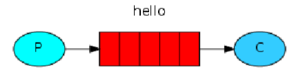
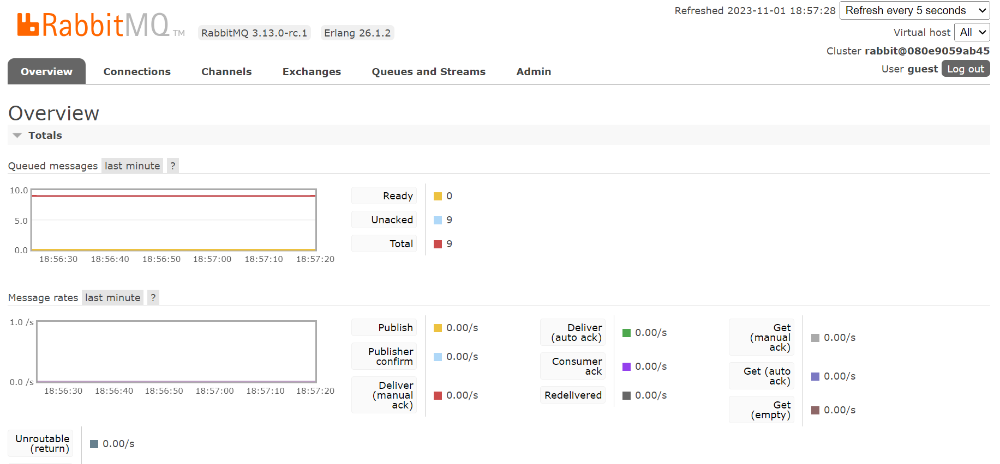
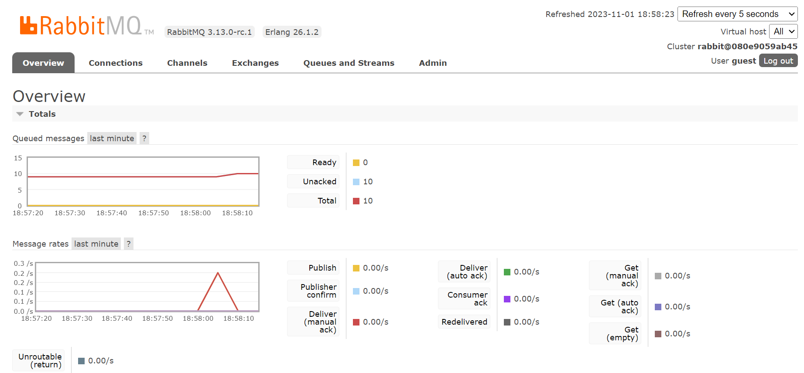

### Small application that mimics a communication between broker and a client through message-oriented middleware (MoM) using RabbitMQ
 <br> 
 
 
 
First clone the repo, then run:

```
docker-compose up
```
to start all services.

On the other hand, open you browser and check "localhost:15672" to access the rabbitMQ UI. Use "guest" for both the username and the password. You should see something like this:

Once the "pika_example" container is running succesfully, run:

```
docker exec -it <your_pika_example_container> /bin/bash
```
to enter into its command line. Run:

```
python sender.py
```
You should be able to see changes in the rabbitMQ, indicating that messages has been sent and received through it:

